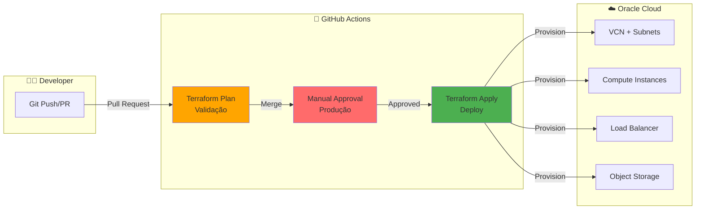

# 🚀 Terraform + GitHub Actions + Oracle Cloud Infrastructure

Guia prático para provisionar recursos na OCI usando Terraform com pipeline CI/CD automatizado no GitHub Actions.

## 🎯 Objetivo

Demonstrar como criar uma pipeline completa de Infrastructure as Code usando **módulos existentes do Terraform** para provisionar recursos na Oracle Cloud de forma automatizada.

## 🏗️ Arquitetura da Pipeline



## 📁 Estrutura do Projeto

```
📁 terraform-oci-demo/
├── 📁 .github/workflows/
│   ├── terraform-plan.yml      # Pipeline de validação (PRs)
│   └── terraform-apply.yml     # Pipeline de deploy (merge)
├── 📁 terraform/
│   ├── main.tf                 # Recursos principais
│   ├── variables.tf            # Variáveis de entrada
│   ├── outputs.tf              # Outputs importantes
│   ├── provider.tf             # Provider OCI
│   └── backend.tf              # Remote state (Object Storage)
├── .gitignore
└── README.md
```

## 🛠️ Módulos Terraform Existentes (Oracle)

Vamos usar os **módulos oficiais da Oracle** disponíveis no Terraform Registry:

### 1. **VCN (Virtual Cloud Network)**
```hcl
module "vcn" {
  source  = "oracle-terraform-modules/vcn/oci"
  version = "3.5.3"

  compartment_id = var.compartment_id
  region         = var.region
  
  vcn_name      = "demo-vcn"
  vcn_dns_label = "demovcn"
  vcn_cidrs     = ["10.0.0.0/16"]
  
  create_internet_gateway = true
  create_nat_gateway      = true
  create_service_gateway  = true
}
```

### 2. **Compute Instance**
```hcl
module "compute" {
  source  = "oracle-terraform-modules/compute-instance/oci"
  version = "2.4.0"

  compartment_id      = var.compartment_id
  instance_count      = 2
  ad_number           = 1
  instance_display_name = "demo-instance"
  
  source_type         = "image"
  source_id           = var.instance_image_id
  
  subnet_id           = module.vcn.subnet_ids["public"]
  shape               = "VM.Standard.E2.1.Micro"  # Always Free
  
  ssh_public_keys     = var.ssh_public_key
}
```

### 3. **Load Balancer**
```hcl
module "load_balancer" {
  source  = "oracle-terraform-modules/load-balancer/oci"
  version = "1.0.0"

  compartment_id = var.compartment_id
  display_name   = "demo-lb"
  shape          = "flexible"
  
  subnet_ids = [module.vcn.subnet_ids["public"]]
  
  backend_sets = {
    "demo-backend" = {
      policy = "ROUND_ROBIN"
      health_checker = {
        protocol = "HTTP"
        port     = 80
        url_path = "/health"
      }
    }
  }
}
```

## 🔐 Configuração de Secrets no GitHub

Configure os seguintes secrets no repositório GitHub:

```bash
# Settings → Secrets and variables → Actions → New repository secret

OCI_TENANCY_OCID        # OCID do tenancy
OCI_USER_OCID           # OCID do usuário
OCI_FINGERPRINT         # Fingerprint da API Key
OCI_PRIVATE_KEY         # Chave privada (base64)
OCI_REGION              # Região (ex: us-ashburn-1)
OCI_COMPARTMENT_ID      # OCID do compartment
```

### Como obter as credenciais OCI:

```bash
# 1. Criar API Key no console OCI
# Profile → User Settings → API Keys → Add API Key

# 2. Converter chave privada para base64
cat ~/.oci/oci_api_key.pem | base64 -w 0

# 3. Obter fingerprint
cat ~/.oci/config | grep fingerprint
```

## 🔄 Pipeline 1: Terraform Plan (Pull Request)

**Arquivo:** `.github/workflows/terraform-plan.yml`

```yaml
name: 'Terraform Plan'

on:
  pull_request:
    branches: [ main ]
    paths:
      - 'terraform/**'
      - '.github/workflows/terraform-plan.yml'

env:
  TF_VERSION: '1.6.0'
  WORKING_DIR: './terraform'

jobs:
  terraform-plan:
    name: 'Terraform Plan'
    runs-on: ubuntu-latest
    
    steps:
      - name: Checkout
        uses: actions/checkout@v4

      - name: Setup Terraform
        uses: hashicorp/setup-terraform@v3
        with:
          terraform_version: ${{ env.TF_VERSION }}

      - name: Configure OCI Credentials
        run: |
          mkdir -p ~/.oci
          echo "${{ secrets.OCI_PRIVATE_KEY }}" | base64 -d > ~/.oci/oci_api_key.pem
          chmod 600 ~/.oci/oci_api_key.pem
          
          cat > ~/.oci/config << EOF
          [DEFAULT]
          user=${{ secrets.OCI_USER_OCID }}
          fingerprint=${{ secrets.OCI_FINGERPRINT }}
          tenancy=${{ secrets.OCI_TENANCY_OCID }}
          region=${{ secrets.OCI_REGION }}
          key_file=~/.oci/oci_api_key.pem
          EOF

      - name: Terraform Format Check
        working-directory: ${{ env.WORKING_DIR }}
        run: terraform fmt -check -recursive

      - name: Terraform Init
        working-directory: ${{ env.WORKING_DIR }}
        run: terraform init

      - name: Terraform Validate
        working-directory: ${{ env.WORKING_DIR }}
        run: terraform validate

      - name: Terraform Plan
        working-directory: ${{ env.WORKING_DIR }}
        env:
          TF_VAR_tenancy_ocid: ${{ secrets.OCI_TENANCY_OCID }}
          TF_VAR_user_ocid: ${{ secrets.OCI_USER_OCID }}
          TF_VAR_fingerprint: ${{ secrets.OCI_FINGERPRINT }}
          TF_VAR_region: ${{ secrets.OCI_REGION }}
          TF_VAR_compartment_id: ${{ secrets.OCI_COMPARTMENT_ID }}
        run: |
          terraform plan -no-color -out=tfplan 2>&1 | tee plan.txt

      - name: Comment PR with Plan
        uses: actions/github-script@v7
        with:
          github-token: ${{ secrets.GITHUB_TOKEN }}
          script: |
            const fs = require('fs');
            const plan = fs.readFileSync('terraform/plan.txt', 'utf8');
            const output = `#### Terraform Plan 📝
            
            <details><summary>Show Plan</summary>
            
            \`\`\`terraform
            ${plan}
            \`\`\`
            
            </details>
            
            *Pushed by: @${{ github.actor }}, Action: \`${{ github.event_name }}\`*`;
            
            github.rest.issues.createComment({
              issue_number: context.issue.number,
              owner: context.repo.owner,
              repo: context.repo.repo,
              body: output
            });
```

## 🚀 Pipeline 2: Terraform Apply (Merge to Main)

**Arquivo:** `.github/workflows/terraform-apply.yml`

```yaml
name: 'Terraform Apply'

on:
  push:
    branches: [ main ]
    paths:
      - 'terraform/**'
      - '.github/workflows/terraform-apply.yml'
  workflow_dispatch:  # Permite execução manual

env:
  TF_VERSION: '1.6.0'
  WORKING_DIR: './terraform'

jobs:
  terraform-apply:
    name: 'Terraform Apply'
    runs-on: ubuntu-latest
    environment: production  # Requer aprovação manual
    
    steps:
      - name: Checkout
        uses: actions/checkout@v4

      - name: Setup Terraform
        uses: hashicorp/setup-terraform@v3
        with:
          terraform_version: ${{ env.TF_VERSION }}

      - name: Configure OCI Credentials
        run: |
          mkdir -p ~/.oci
          echo "${{ secrets.OCI_PRIVATE_KEY }}" | base64 -d > ~/.oci/oci_api_key.pem
          chmod 600 ~/.oci/oci_api_key.pem
          
          cat > ~/.oci/config << EOF
          [DEFAULT]
          user=${{ secrets.OCI_USER_OCID }}
          fingerprint=${{ secrets.OCI_FINGERPRINT }}
          tenancy=${{ secrets.OCI_TENANCY_OCID }}
          region=${{ secrets.OCI_REGION }}
          key_file=~/.oci/oci_api_key.pem
          EOF

      - name: Terraform Init
        working-directory: ${{ env.WORKING_DIR }}
        run: terraform init

      - name: Terraform Plan
        working-directory: ${{ env.WORKING_DIR }}
        env:
          TF_VAR_tenancy_ocid: ${{ secrets.OCI_TENANCY_OCID }}
          TF_VAR_user_ocid: ${{ secrets.OCI_USER_OCID }}
          TF_VAR_fingerprint: ${{ secrets.OCI_FINGERPRINT }}
          TF_VAR_region: ${{ secrets.OCI_REGION }}
          TF_VAR_compartment_id: ${{ secrets.OCI_COMPARTMENT_ID }}
        run: terraform plan -out=tfplan

      - name: Terraform Apply
        working-directory: ${{ env.WORKING_DIR }}
        env:
          TF_VAR_tenancy_ocid: ${{ secrets.OCI_TENANCY_OCID }}
          TF_VAR_user_ocid: ${{ secrets.OCI_USER_OCID }}
          TF_VAR_fingerprint: ${{ secrets.OCI_FINGERPRINT }}
          TF_VAR_region: ${{ secrets.OCI_REGION }}
          TF_VAR_compartment_id: ${{ secrets.OCI_COMPARTMENT_ID }}
        run: terraform apply -auto-approve tfplan

      - name: Terraform Output
        working-directory: ${{ env.WORKING_DIR }}
        run: terraform output -json > outputs.json

      - name: Upload Outputs
        uses: actions/upload-artifact@v4
        with:
          name: terraform-outputs
          path: terraform/outputs.json

      - name: Notify Success
        if: success()
        run: |
          echo "✅ Terraform Apply completed successfully!"
          echo "📊 Check outputs artifact for resource details"
```

## 📝 Exemplo de Código Terraform

### `terraform/main.tf`

```hcl
terraform {
  required_version = ">= 1.6.0"
  
  required_providers {
    oci = {
      source  = "oracle/oci"
      version = "~> 5.0"
    }
  }
}

# VCN Module
module "vcn" {
  source  = "oracle-terraform-modules/vcn/oci"
  version = "3.5.3"

  compartment_id = var.compartment_id
  region         = var.region
  
  vcn_name      = "${var.project_name}-vcn"
  vcn_dns_label = "${var.project_name}vcn"
  vcn_cidrs     = ["10.0.0.0/16"]
  
  create_internet_gateway = true
  create_nat_gateway      = true
  create_service_gateway  = true
}

# Compute Instances
module "compute" {
  source  = "oracle-terraform-modules/compute-instance/oci"
  version = "2.4.0"

  compartment_id        = var.compartment_id
  instance_count        = var.instance_count
  ad_number             = 1
  instance_display_name = "${var.project_name}-instance"
  
  source_type = "image"
  source_id   = var.instance_image_id
  
  subnet_id = module.vcn.subnet_ids["public"]
  shape     = "VM.Standard.E2.1.Micro"  # Always Free
  
  ssh_public_keys = var.ssh_public_key
  
  tags = {
    Environment = var.environment
    ManagedBy   = "Terraform"
    Project     = var.project_name
  }
}
```

### `terraform/variables.tf`

```hcl
variable "tenancy_ocid" {
  description = "OCID do Tenancy OCI"
  type        = string
}

variable "user_ocid" {
  description = "OCID do Usuário OCI"
  type        = string
}

variable "fingerprint" {
  description = "Fingerprint da API Key"
  type        = string
}

variable "region" {
  description = "Região OCI"
  type        = string
  default     = "us-ashburn-1"
}

variable "compartment_id" {
  description = "OCID do Compartment"
  type        = string
}

variable "project_name" {
  description = "Nome do projeto"
  type        = string
  default     = "demo"
}

variable "environment" {
  description = "Ambiente (dev/staging/prod)"
  type        = string
  default     = "dev"
}

variable "instance_count" {
  description = "Número de instâncias"
  type        = number
  default     = 2
}

variable "instance_image_id" {
  description = "OCID da imagem Oracle Linux"
  type        = string
  # Oracle Linux 8 - us-ashburn-1
  default = "ocid1.image.oc1.iad.aaaaaaaa..."
}

variable "ssh_public_key" {
  description = "Chave SSH pública"
  type        = string
}
```

### `terraform/outputs.tf`

```hcl
output "vcn_id" {
  description = "OCID da VCN criada"
  value       = module.vcn.vcn_id
}

output "subnet_ids" {
  description = "OCIDs das subnets criadas"
  value       = module.vcn.subnet_ids
}

output "instance_ids" {
  description = "OCIDs das instâncias criadas"
  value       = module.compute.instance_id
}

output "instance_public_ips" {
  description = "IPs públicos das instâncias"
  value       = module.compute.public_ip
}
```

### `terraform/provider.tf`

```hcl
provider "oci" {
  tenancy_ocid     = var.tenancy_ocid
  user_ocid        = var.user_ocid
  fingerprint      = var.fingerprint
  private_key_path = "~/.oci/oci_api_key.pem"
  region           = var.region
}
```

### `terraform/backend.tf`

```hcl
terraform {
  backend "s3" {
    bucket                      = "terraform-state-bucket"
    key                         = "demo/terraform.tfstate"
    region                      = "us-ashburn-1"
    endpoint                    = "https://namespace.compat.objectstorage.us-ashburn-1.oraclecloud.com"
    skip_region_validation      = true
    skip_credentials_validation = true
    skip_metadata_api_check     = true
    force_path_style            = true
  }
}
```

## 🎯 Fluxo de Trabalho

### 1. **Desenvolvimento Local**
```bash
# Clone o repositório
git clone https://github.com/seu-usuario/terraform-oci-demo
cd terraform-oci-demo/terraform

# Configure credenciais OCI
export TF_VAR_tenancy_ocid="ocid1.tenancy..."
export TF_VAR_user_ocid="ocid1.user..."
export TF_VAR_fingerprint="aa:bb:cc..."
export TF_VAR_compartment_id="ocid1.compartment..."

# Inicialize Terraform
terraform init

# Valide configuração
terraform validate

# Veja o plano
terraform plan

# Aplique localmente (opcional)
terraform apply
```

### 2. **Pull Request (Validação)**
```bash
# Crie uma branch
git checkout -b feature/add-load-balancer

# Faça alterações no código Terraform
vim terraform/main.tf

# Commit e push
git add .
git commit -m "Add load balancer module"
git push origin feature/add-load-balancer

# Crie PR no GitHub
# ✅ Pipeline terraform-plan executa automaticamente
# ✅ Comentário com o plan aparece no PR
```

### 3. **Merge to Main (Deploy)**
```bash
# Após aprovação, merge o PR
# ✅ Pipeline terraform-apply executa automaticamente
# ✅ Requer aprovação manual (environment: production)
# ✅ Recursos são provisionados na OCI
```

## 🔍 Monitoramento da Pipeline

### GitHub Actions UI
```
Actions → Workflows → Terraform Plan/Apply
├── ✅ Checkout code
├── ✅ Setup Terraform
├── ✅ Configure OCI credentials
├── ✅ Terraform init
├── ✅ Terraform validate
├── ✅ Terraform plan
└── ✅ Terraform apply (se merge)
```

### Logs Importantes
```bash
# Ver logs do plan
cat terraform/plan.txt

# Ver outputs
cat terraform/outputs.json

# Ver state
terraform show
```

## 🛡️ Segurança e Best Practices

### ✅ Fazer:
- Usar módulos oficiais e versionados
- Armazenar credenciais em GitHub Secrets
- Usar remote state (Object Storage)
- Implementar aprovação manual para produção
- Validar código antes do apply (fmt, validate)
- Usar tags em todos os recursos
- Documentar variáveis e outputs

### ❌ Não Fazer:
- Commitar credenciais no código
- Usar `terraform apply` sem plan
- Ignorar erros de validação
- Criar recursos sem tags
- Usar versões não fixadas de módulos
- Fazer apply direto em produção

## 💰 Recursos OCI Free Tier

Recursos **Always Free** disponíveis:
- ✅ 2x Compute VM.Standard.E2.1.Micro (1 OCPU, 1GB RAM)
- ✅ 2x Block Volumes (100GB total)
- ✅ 10GB Object Storage
- ✅ 1x VCN
- ✅ Load Balancer (10 Mbps)
- ✅ Autonomous Database (2x 20GB)

## 🔧 Troubleshooting

### Erro: "Service error: NotAuthenticated"
```bash
# Verificar credenciais
cat ~/.oci/config
oci iam user get --user-id $OCI_USER_OCID

# Recriar API Key se necessário
```

### Erro: "out of host capacity"
```bash
# Trocar availability domain
ad_number = 2  # ou 3
```

### Erro: "shape not available"
```bash
# Usar shape Always Free
shape = "VM.Standard.E2.1.Micro"
```

## 📚 Recursos Adicionais

- [Terraform OCI Provider](https://registry.terraform.io/providers/oracle/oci/latest/docs)
- [Oracle Terraform Modules](https://registry.terraform.io/namespaces/oracle-terraform-modules)
- [OCI Free Tier](https://www.oracle.com/cloud/free/)
- [GitHub Actions Docs](https://docs.github.com/en/actions)

## 🎓 Informações da Aula

**Professor:** José Neto  
**Curso:** DevOps e Arquitetura Cloud - FIAP  
**Tema:** Infrastructure as Code com Terraform + CI/CD  
**Data:** 2026  

---

**🚀 Happy Terraforming!**
